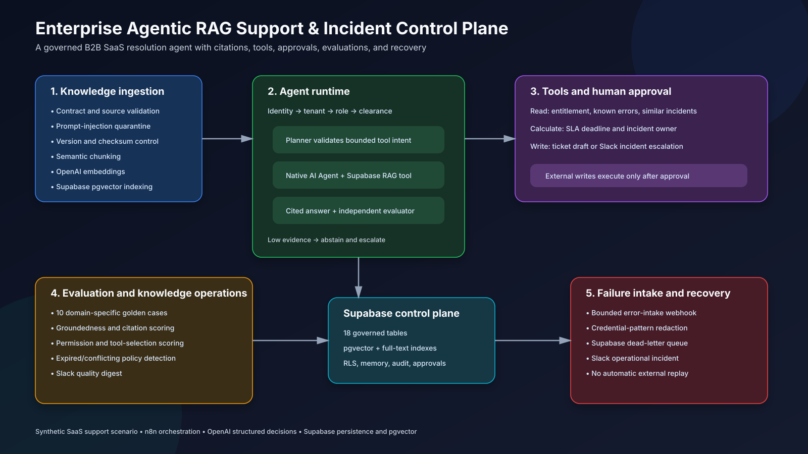
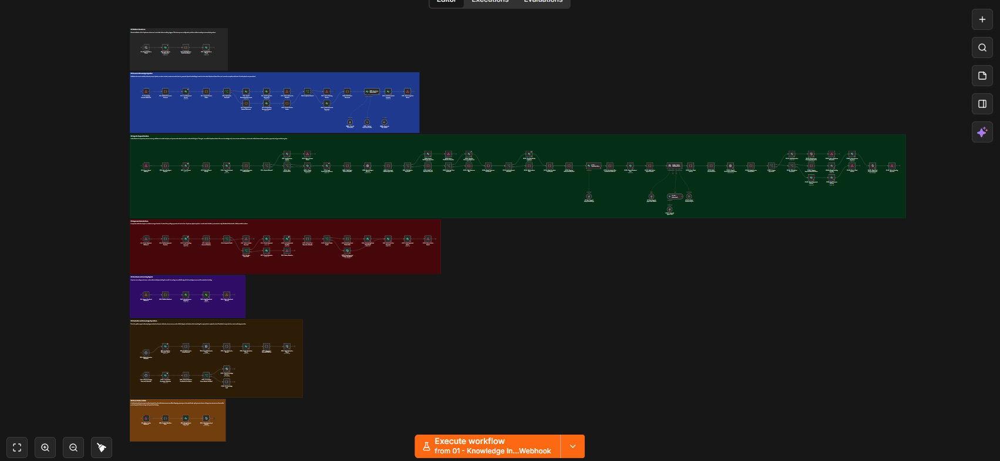

# Enterprise Agentic RAG Support & Incident Control Plane

An agentic AI support and incident-resolution system for B2B SaaS operations. Built in n8n with OpenAI, Supabase pgvector, native business integrations, permission-aware retrieval, evidence citations, independent answer evaluation, and human-approved actions.

This is not a generic “chat with your documents” template. It solves a defined operational problem: helping SaaS support teams investigate incidents using current product documentation, customer entitlements, historical tickets, security policy, and approval rules.

## n8n workflow canvas

The screenshot below shows the complete importable workflow, including governed ingestion, the native AI Agent runtime, approval-controlled actions, feedback, evaluation, and failure intake.

## Business problem

A support representative handling a production incident must usually search several systems:

- the customer's subscription and support entitlement;
- current SLA and severity policies;
- technical troubleshooting runbooks;
- known errors and similar incidents;
- security and data-handling rules;
- ticket history and current ownership.

A normal RAG chatbot only searches documents and generates text. It does not verify who is asking, whether the document is current, whether the user may access it, whether customer-specific terms override general policy, or whether the requested action requires approval.

The workflow combines these controls in one auditable system.

## Primary scenario

A support agent asks:

> All Acme Logistics users receive a SAML signature error after certificate rotation. What should we check, what SLA applies, and prepare an escalation.

The system:

1. authenticates the support representative;
2. loads the user's tenant, role, department, and clearance;
3. identifies Acme Logistics and its Enterprise support plan;
4. finds Acme's 20-minute SEV-1 contract override;
5. retrieves the current SAML troubleshooting runbook;
6. finds a similar resolved certificate-rotation incident;
7. excludes a superseded one-hour SLA document;
8. produces an evidence-backed response with citations;
9. independently evaluates groundedness and citation quality;
10. prepares a Slack incident escalation;
11. waits for an incident manager's approval;
12. executes the approved action and records the audit trail.

## What makes the workflow agentic

The runtime uses a native n8n **AI Agent** node, not a disguised single LLM call. An OpenAI planning step first returns a bounded execution plan. Deterministic workflow logic validates the plan, authorizes customer and incident context, and then hands the request to the AI Agent.

The AI Agent receives an OpenAI chat model, a structured output parser, and an **Authorized Supabase Knowledge Tool** through n8n's AI sub-node connections. It can decide when another knowledge search is needed, formulate the search, inspect the returned evidence, and iterate before producing its cited answer. Tenant, department, role, clearance, approval, and quality controls remain outside the model.

### Read tools

| Tool | Business purpose |
| --- | --- |
| knowledge_search | Search current, authorized support documents |
| get_customer_entitlement | Load plan, support tier, features, and contract overrides |
| search_known_errors | Find known product symptoms and resolutions |
| find_similar_incidents | Find relevant historical customer incidents |
| calculate_sla_deadline | Apply policy and customer-specific response targets |
| get_incident_owner | Select the accountable support or incident team |

### Write tools

| Tool | Result | Control |
| --- | --- | --- |
| create_ticket_draft | Creates a synthetic support-ticket draft | Human approval required |
| prepare_incident_escalation | Posts an incident escalation to Slack | Human approval required |

The model cannot invent another tool, directly query arbitrary tables, or execute an external write without passing the allowlist and approval checks.

## End-to-end architecture

~~~mermaid
flowchart TD
    A[Document ingestion webhook] --> B[Validate source and metadata]
    B --> C{Prompt injection?}
    C -->|Yes| D[Quarantine and audit]
    C -->|No| E[Version and checksum]
    E --> F[Semantic chunking]
    F --> G[OpenAI embeddings]
    G --> H[(Supabase pgvector)]

    I[Support question] --> J[Authenticate tenant and user]
    J --> K[Restore conversation memory]
    K --> L[OpenAI agent planner]
    L --> M[Allowlisted customer and incident tools]
    L --> N[Permission-aware pre-retrieval]
    M --> O[Evidence package]
    N --> O
    O --> P[Native n8n AI Agent]
    H -. Supabase knowledge tool .-> P
    P --> Q[Independent groundedness evaluator]

    Q -->|Insufficient evidence| R[Abstain and human escalation]
    Q -->|Answer only| S[Return cited response]
    Q -->|Write proposed| T[(Pending tool run)]
    T --> U[Human approval webhook]
    U -->|Approved| V[Execute bounded action]
    U -->|Rejected| W[Cancel action]

    X[Evaluation schedule] --> Y[Golden support cases]
    Y --> Z[Quality digest]
    AA[n8n instance error workflow] --> AB[Failure intake webhook]
    AB --> AC[(Dead-letter queue)]
~~~

## One workflow, seven operational modules

The generated n8n export contains more than 120 nodes on one documented canvas:

| Module | Purpose |
| --- | --- |
| 00 | Manual Supabase platform-readiness check |
| 01 | Governed ingestion, quarantine, versioning, embeddings, and indexing |
| 02 | Authentication, memory, planning, tools, RAG, citations, and evaluation |
| 03 | Human approval and controlled action execution |
| 04 | User feedback capture |
| 05 | Golden-case evaluation and knowledge freshness |
| 99 | Bounded failure intake, sanitized dead-letter storage, and operational alerting |

## Domain-specific knowledge

The repository contains nine synthetic SaaS support documents:

- support plans and entitlements;
- incident severity and escalation matrix;
- SAML SSO troubleshooting runbook;
- API rate limits and retry guidance;
- refund and cancellation policy;
- support data-handling policy;
- Enterprise onboarding SOP;
- a superseded SLA policy;
- an intentionally malicious customer upload used to test prompt-injection quarantine.

The synthetic dataset also includes three customers, three historical incidents, role-based users, customer-specific overrides, and ten evaluation cases.

## Retrieval and answer controls

### Before retrieval

- Tenant must be active.
- User must be active and belong to the tenant.
- User request is screened for prompt-injection patterns.
- Planner output is restricted to known tools.

### During retrieval

- Supabase pgvector performs semantic retrieval.
- The native AI Agent can call the tenant-filtered Supabase Vector Store as a knowledge tool when additional evidence is needed.
- Metadata filters scope tenant, status, department, and quarantine state.
- Workflow code enforces role and clearance.
- Keyword overlap reranks the authorized candidate set.
- Superseded, expired, or quarantined content is excluded.

### Before answering

- The answer must contain citations and supporting quotes.
- Current approved policy takes priority over superseded material.
- Customer contract overrides take priority over general SLA targets.
- Missing evidence and conflicting sources must be surfaced.
- A separate OpenAI call evaluates groundedness, citations, and permission safety.
- Deterministic thresholds decide whether to answer or escalate.

## Supabase control plane

The schema provides:

- tenant and user identity;
- governed sources and versioned documents;
- a native n8n-compatible vector table;
- customer entitlements and support tickets;
- conversations and messages;
- retrieval and tool-run evidence;
- approvals and feedback;
- evaluation cases and results;
- audit events and a dead-letter queue.

The schema enables pgvector, HNSW vector indexing, PostgreSQL full-text indexing, JSON metadata indexing, row-level security, a native n8n match function, and a custom hybrid-search function.

## Installation

### Requirements

- n8n with OpenAI, OpenAI Embeddings, Supabase, Supabase Vector Store, and Slack nodes
- Supabase project with pgvector
- OpenAI account
- Slack workspace and private test channel
- Node.js 20 or later for repository validation

### 1. Clone

~~~bash
git clone https://github.com/gaboscini/n8n-agentic-rag-knowledge-copilot.git
cd n8n-agentic-rag-knowledge-copilot
~~~

### 2. Create the database

Run these files in the Supabase SQL editor:

1. **supabase/schema.sql**
2. **supabase/seed.sql**

The seed contains only synthetic SaaS support users, customers, tickets, sources, and evaluation cases.

### 3. Import the n8n workflow

Import:

**workflows/enterprise-agentic-rag-support-control-plane.json**

Keep it inactive while configuring credentials.

### 4. Map credentials

Configure the native nodes inside n8n:

| Integration | Use |
| --- | --- |
| OpenAI | Planner, native AI Agent chat model, groundedness evaluator, evaluation judge |
| OpenAI Embeddings | Document, pre-retrieval query, and agent-tool embeddings |
| Supabase | State, identity, customers, tickets, memory, tools, approvals, evaluation, audit |
| Supabase Vector Store | Knowledge insertion, deterministic similarity search, and AI Agent knowledge tool |
| Slack | Human escalation, approval request, incident action, quality and operations alerts |

Replace **REPLACE_WITH_SLACK_CHANNEL_ID** with a private test channel.

### 5. Index the knowledge

Post each file under **knowledge/** to:

**POST /webhook-test/agentic-rag-knowledge-ingest**

Example:

~~~json
{
  "tenantId": "10000000-0000-4000-8000-000000000001",
  "sourceId": "30000000-0000-4000-8000-000000000001",
  "externalDocumentId": "KB-SSO-2026",
  "title": "SAML SSO Troubleshooting Runbook",
  "version": "4.1",
  "documentType": "runbook",
  "content": "PASTE THE SYNTHETIC DOCUMENT CONTENT",
  "sensitivity": 2,
  "allowedRoles": ["support_agent", "incident_manager", "knowledge_admin"]
}
~~~

Use the customer-upload source for the intentionally malicious document. It should be quarantined rather than embedded.

### 6. Ask the agent

**POST /webhook-test/agentic-rag-support-agent**

~~~json
{
  "tenantKey": "saas-support-demo",
  "externalUserId": "agent-104",
  "customerKey": "CUS-ACME-001",
  "question": "All Acme users receive a SAML signature error after certificate rotation. What should we check and what SLA applies?",
  "requestedAction": "prepare_incident_escalation"
}
~~~

The response contains an answer, citations, confidence, correlation ID, conversation ID, and—when a write is proposed—an approval ID.

### 7. Approve or reject the action

**POST /webhook-test/agentic-rag-action-approval**

~~~json
{
  "tenantId": "10000000-0000-4000-8000-000000000001",
  "approvalId": "APPROVAL_ID_FROM_AGENT",
  "approverExternalId": "incident-manager-22",
  "decision": "approved",
  "reason": "Customer impact and evidence confirmed"
}
~~~

### 8. Submit feedback

**POST /webhook-test/agentic-rag-answer-feedback**

~~~json
{
  "tenantId": "10000000-0000-4000-8000-000000000001",
  "conversationId": "CONVERSATION_ID_FROM_AGENT",
  "messageId": "ASSISTANT_MESSAGE_ID",
  "rating": 5,
  "reasonCode": "resolved_issue",
  "comment": "The policy and SSO citations were correct."
}
~~~

## Evaluation suite

The included cases cover:

- current versus superseded policy;
- customer-specific SLA overrides;
- multi-source troubleshooting;
- permission denial;
- document and user prompt injection;
- unsupported guarantees;
- approval-gated actions;
- refund authority;
- secret handling.

The runtime quality gate requires permission safety plus groundedness and citation scores of at least 0.82.

## Repository validation

~~~powershell
npm.cmd run build
npm.cmd test
~~~

The builder deterministically regenerates the n8n export. The validator checks node integrity, Code-node syntax, canvas organization, integration coverage, Supabase controls, datasets, credential exclusion, and public portfolio safety. GitHub Actions runs the same process for pushes and pull requests.

## Security model

- No credentials or production customer data are committed.
- Documents containing prompt-injection indicators are quarantined.
- Retrieval is tenant-, role-, department-, clearance-, version-, and status-aware.
- External writes require a separate approval event.
- Errors are sanitized before entering the dead-letter queue.
- Sensitive or weakly supported answers are escalated.

Environment-specific ingress authentication, source verification, RLS policies, retention, monitoring, backup, and recovery remain deployment responsibilities. See [Security policy](SECURITY.md).

## Documentation

- [Architecture](docs/ARCHITECTURE.md)
- [Setup](docs/SETUP.md)
- [Demonstration guide](docs/DEMO_GUIDE.md)
- [Testing](docs/TESTING.md)
- [Security policy](SECURITY.md)

## Author

**gaboscini**  
AI automation, cloud solution design, and enterprise workflow engineering

## License

Released under the [MIT License](LICENSE).
